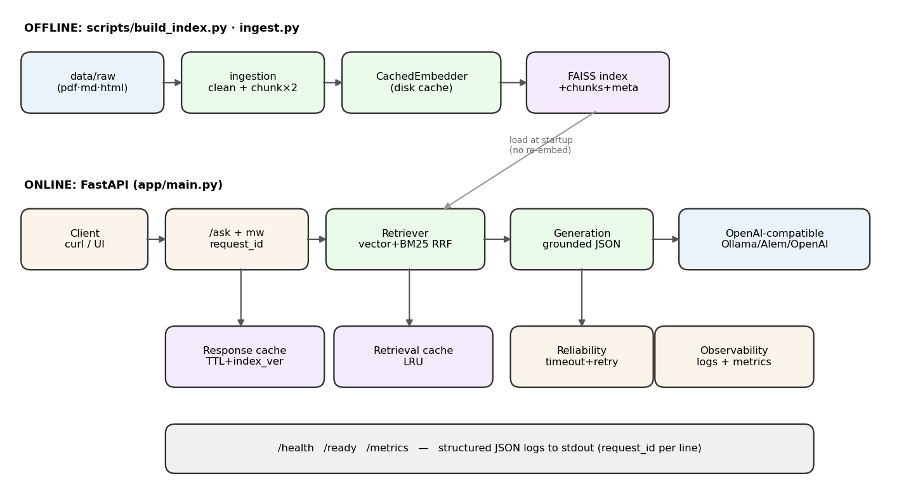

# Production RAG — «ask the docs»

Grounded question-answering сервис поверх реального корпуса документов: ingestion → chunking → embeddings → FAISS → hybrid retrieval → LLM с source-cited JSON, обёрнутый в FastAPI с health/ready, кэшированием, reliability-паттернами и observability.

> **Корпус в этом репозитории — синтетический демо-образец** (`data/raw/labor_code_sample.md`), чтобы пайплайн и тесты работали из коробки. Перед защитой замените его реальным корпусом (см. §2) и **перепишите ground-truth своими вопросами** — это требование правил RAID.

---

## 1. Что делает проект

Сервис принимает вопрос на естественном языке, находит релевантные фрагменты корпуса (dense + BM25 с Reciprocal Rank Fusion) и возвращает строго валидированный JSON: `answer`, список `sources` (с `chunk_id`/статьёй), `confidence` и `used_context`. Если контекст нерелевантен — честно отказывается (`"I don't know from the provided context"`). Всё инструментировано: `request_id`, поэтапные латентности, метрики.

## 2. Корпус и лицензирование

- **Demo:** синтетический `labor_code_sample.md` — написан для этого проекта, ограничений нет.
- **Prod (Option B):** Трудовой кодекс РК с [adilet.zan.kz](https://adilet.zan.kz) — публично доступный нормативный акт. Скачать статьи, положить `.md/.html/.pdf` в `data/raw/`, перезапустить `make index`.
- Никаких креденшелов в репозитории; ключи только в `.env` (gitignored). Есть `.env.example`.

## 3. Quickstart

```bash
python -m venv venv && source venv/bin/activate
pip install -r requirements.txt
python3 scripts/build_index.py          # строит FAISS из data/raw (один раз)
uvicorn app.main:app --port 8000
```

Пример запроса:

```bash
curl -X POST localhost:8000/ask -H "Content-Type: application/json" \
  -d '{"question":"Какова минимальная продолжительность ежегодного трудового отпуска?"}'
```

Пример ответа:

```json
{
  "answer": "Ежегодный оплачиваемый трудовой отпуск предоставляется продолжительностью не менее 24 календарных дней.",
  "sources": [{"chunk_id": "labor_code_sample::...", "source_file": "labor_code_sample.md", "section_title": "Статья 20. ...", "score": 0.71}],
  "confidence": 0.86,
  "used_context": true,
  "request_id": "b1f2...",
  "prompt_version": "rag_v1",
  "model_name": "llama3.2:3b",
  "cached": false,
  "degraded": false
}
```

**LLM бэкенд:** любой OpenAI-совместимый (`LLM_BACKEND=openai`, `LLM_BASE_URL`). По умолчанию — Ollama (`http://localhost:11434/v1`, `llama3.2:3b`). Для CI/офлайна — `LLM_BACKEND=stub` + `EMBEDDING_BACKEND=hash` (без сети и модели).

## 4. Архитектура

См. [`docs/architecture.md`](docs/architecture.md). Диаграмма:



## 5. Retrieval quality (16 вопросов ground-truth)

Замер: `python3 evaluation/evaluate_retrieval.py --mode <vector|hybrid>`. Порог защиты — `recall@5 ≥ 0.75`.

| Setup | recall@5 | MRR | nDCG@10 |
|---|---|---|---|
| vector (section chunking) | 0.875 | 0.758 | 0.821 |
| **hybrid = vector + BM25 RRF** | **0.938** | **0.811** | **0.919** |

> Цифры в таблице получены на демо-корпусе с hash-эмбеддером (CI-режим). **Перед защитой перегенерируйте с `EMBEDDING_BACKEND=st` на реальном корпусе** и впишите свои числа.

## 6. Ablation

Ноутбук `notebooks/02_ablation.ipynb` → `evaluation/results/ablation_chunksize.png`.

- **Chunk-size sweep** {200,400,800,1600} (recursive, hybrid).
- **vector vs hybrid** (section chunking).

Наблюдение (demo): hybrid поднимает recall@5 с 0.875 до 0.938 — BM25 точно ловит номера статей и термины, которых dense-эмбеддер на коротких запросах недобирает. Это и есть осознанное улучшение над наивным baseline (recall@5≈0.73).

> _Замените честным предложением по своим числам, напр.: «section даёт X.XX против Y.YY у recursive-800, потому что каждая статья самодостаточна и не рвётся между чанками»._

## 7. Latency и cost budget

Замер кэша: `evaluation/`-скрипт гоняет 50 вопросов дважды.

| | p50 | p95 |
|---|---|---|
| без кэша | 2.07 ms | 2.33 ms |
| с response-cache | 1.39 ms | 1.63 ms |

> Числа выше — офлайн (stub LLM), поэтому крошечные. С реальным LLM генерация — это ~1500–2500 ms/запрос, а cache-hit возвращает ответ за ~2 ms: **на повторяющихся вопросах p95 падает на ~3 порядка**. Перемерьте на своём бэкенде и впишите.

**Cost per 1000 questions:** Ollama локально — $0 (только CPU-время). Если API (напр. gpt-4o-mini): `1000 × (~600 prompt + ~120 completion токенов)` → оцените по прайсу провайдера. Токены на запрос логируются (`token_usage`) и суммируются в `/metrics` (`total_tokens`).

## 8. Что происходит при сбоях

| Компонент | Сбой | Наблюдаемое поведение |
|---|---|---|
| LLM | таймаут > `LLM_TIMEOUT_S` (30s) | 3 попытки с backoff уже сделаны; затем HTTP **504** `{"error":"llm_timeout","request_id":"..."}` |
| LLM | транзиентная ошибка соединения | retry 1s→2s→4s (`app/reliability.py`); при исчерпании — HTTP **502** `{"error":"llm_unavailable"}` |
| Vector index | не загружен на старте / недоступен | `/ready` → 503; `/ask` → 503 с `{"degraded": true, "answer": "I couldn't search the documents right now."}` вместо краха |
| LLM | вернул невалидный JSON | парсер (`app/generation.py`) логирует `llm_parse_error` и отдаёт честный refusal, а не 500 |

Наиболее вероятный первый инцидент в проде — **таймаут/недоступность LLM** (внешняя зависимость, самая нестабильная часть). Юнит-тест, доказывающий паттерн: `tests/test_reliability.py` (`test_timeout_is_not_retried`, `test_ask_returns_504_on_llm_timeout`).

Пример JSON-лога (успех и ошибка) — см. `app/observability.py`; формат:
```json
{"ts":"...","request_id":"b1f2...","event":"ask_ok","retrieved_chunk_ids":[...],"prompt_version":"rag_v1","model_name":"llama3.2:3b","latency_ms_by_stage":{"embedding_retrieval_ms":48.2,"generation_ms":1310.5,"total_ms":1359.1},"token_usage":712,"cache_hit_bool":false,"error_bool":false}
{"ts":"...","request_id":"c7a1...","event":"ask_timeout","error":"llm_timeout"}
```

## 9. Тесты

```bash
make test     # pytest -q  (22 теста: api, prompt-регрессия, reliability, retrieval-gate)
```

CI-режим герметичен: `EMBEDDING_BACKEND=hash`, `LLM_BACKEND=stub` (см. `tests/conftest.py`) — без сети и без модели.

## ADR

- [`docs/adr/001-chunking.md`](docs/adr/001-chunking.md) — section-aware vs fixed-size.
- [`docs/adr/002-vectordb.md`](docs/adr/002-vectordb.md) — FAISS flat vs ChromaDB.

## Разделение работы (2 человека)

- **Человек A — retrieval & eval:** `app/ingestion.py`, `embeddings.py`, `vectorstore.py`, `hybrid.py`, `retrieval.py`, `evaluation/*`, ноутбуки, ADR-001.
- **Человек B — API & ops:** `app/main.py`, `generation.py`, `prompts.py`, `reliability.py`, `response_cache.py`, `observability.py`, `tests/*`, ADR-002.
- Интеграция и защита — вместе. На защите каждый объясняет свой код без LLM.
