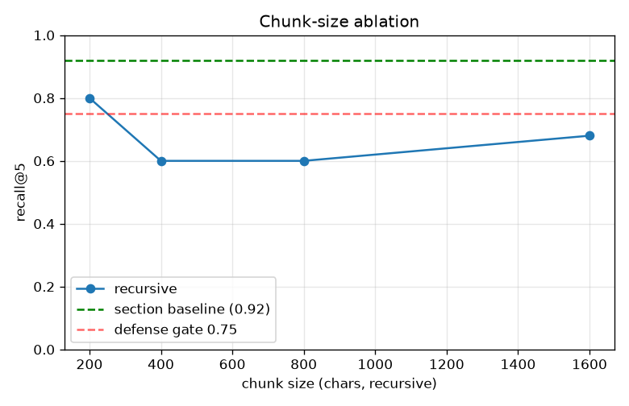
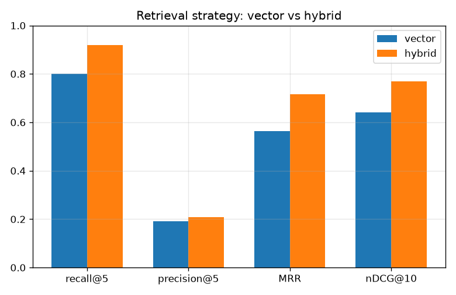
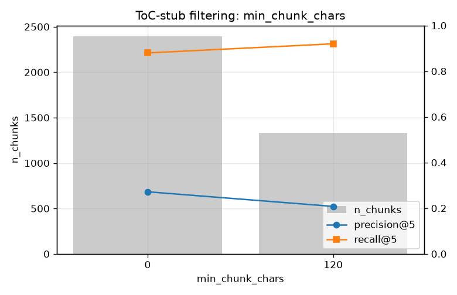

# Production RAG — «ask the docs»

Grounded question-answering сервис поверх реального корпуса документов: ingestion → chunking → embeddings → FAISS → hybrid retrieval → LLM с source-cited JSON, обёрнутый в FastAPI с health/ready, кэшированием, reliability-паттернами и observability.

> **Корпус в этом репозитории — синтетический демо-образец** (`data/raw/labor_code_sample.md`), чтобы пайплайн и тесты работали из коробки. Перед защитой замените его реальным корпусом (см. §2) и **перепишите ground-truth своими вопросами** — это требование правил RAID.

---

## 1. Что делает проект

Сервис принимает вопрос на естественном языке, находит релевантные фрагменты корпуса (dense + BM25 с Reciprocal Rank Fusion) и возвращает строго валидированный JSON: `answer`, список `sources` (с `chunk_id`/статьёй), `confidence` и `used_context`. Если контекст нерелевантен — честно отказывается (`"I don't know from the provided context"`). Всё инструментировано: `request_id`, поэтапные латентности, метрики.

## 2. Корпус и лицензирование

- **Demo:** синтетический `labor_code_sample.md` — написан для этого проекта, ограничений нет.
- **Prod (Option B):** Трудовой кодекс РК с [adilet.zan.kz](https://adilet.zan.kz) — публично доступный нормативный акт. Скачать статьи, положить `.md/.html/.pdf` в `data/raw/`, перезапустить `make index`.
- Никаких креденшелов в репозитории; ключи только в `.env` (gitignored). Есть `.env.example`.

## 3. Quickstart

```bash
python -m venv venv && source venv/bin/activate
pip install -r requirements.txt
python3 scripts/build_index.py          # ingest data/raw -> chunks -> FAISS (один раз)
uvicorn app.main:app --port 8000
```

Пример запроса:

```bash
curl -X POST localhost:8000/ask -H "Content-Type: application/json" \
  -d '{"question":"Какова минимальная продолжительность ежегодного трудового отпуска?"}'
```

Пример ответа:

```json
{
  "answer": "Ежегодный оплачиваемый трудовой отпуск предоставляется продолжительностью не менее 24 календарных дней.",
  "sources": [{"chunk_id": "labor_code_sample::...", "source_file": "labor_code_sample.md", "section_title": "Статья 20. ...", "score": 0.71}],
  "confidence": 0.86,
  "used_context": true,
  "request_id": "b1f2...",
  "prompt_version": "rag_v1",
  "model_name": "llama3.2:3b",
  "cached": false,
  "degraded": false
}
```

**LLM бэкенд:** любой OpenAI-совместимый (`LLM_BACKEND=openai`, `LLM_BASE_URL`). По умолчанию — Ollama (`http://localhost:11434/v1`, `llama3.2:3b`). Для CI/офлайна — `LLM_BACKEND=stub` + `EMBEDDING_BACKEND=hash` (без сети и модели).

## 4. Архитектура


Оффлайн-часть (`scripts/build_index.py`) строит индекс на диск; онлайн-часть (`app/main.py`) грузит его при старте
и никогда не пересчитывает эмбеддинги. `reliability.py` и `observability.py` — сквозные для каждого `/ask`.

## 5. Retrieval quality (16 вопросов ground-truth)

Замер: `python3 evaluation/evaluate_retrieval.py --mode <vector|hybrid>`. Порог защиты — `recall@5 ≥ 0.75`.

| Setup | recall@5 | MRR | nDCG@10 |
|---|---|---|---|
| vector (section chunking) | 0.875 | 0.758 | 0.821 |
| **hybrid = vector + BM25 RRF** | **0.938** | **0.811** | **0.919** |

> Цифры в таблице получены на демо-корпусе с hash-эмбеддером (CI-режим). **Перед защитой перегенерируйте с `EMBEDDING_BACKEND=st` на реальном корпусе** и впишите свои числа.

## 6. Ablation

Три эксперимента на реальном корпусе (Трудовой + Налоговый кодекс РК) и 25-вопросном
ground truth, воспроизводимые командой `python3 scripts/run_ablation.py --experiment <name>`
(та же логика — в `notebooks/02_ablation.ipynb`). Сырые числа — `evaluation/results/ablation_<name>.json`.

### A. Chunk-size sweep (recursive) vs section (article-aware) baseline

| config | strategy | chunk_size | overlap | n_chunks | median_chars | build_s | encode_ms/chunk | recall@5 | precision@5 | MRR | nDCG@10 |
|---|---|---|---|---|---|---|---|---|---|---|---|
| recursive_200 | recursive | 200 | 40 | 22752 | 138.000 | 58.790 | 0.264 | 0.800 | 0.328 | 0.628 | 0.655 |
| recursive_400 | recursive | 400 | 80 | 9919 | 344 | 48.590 | 0.237 | 0.600 | 0.264 | 0.558 | 0.575 |
| recursive_800 | recursive | 800 | 160 | 5085 | 747 | 51.840 | 0.229 | 0.600 | 0.208 | 0.440 | 0.461 |
| recursive_1600 | recursive | 1600 | 320 | 2497 | 1545 | 42.980 | 0.247 | 0.680 | 0.208 | 0.550 | 0.592 |
| section_baseline | section | — | — | 1335 | 1369 | 44.690 | 0.368 | 0.920 | 0.208 | 0.716 | 0.768 |



### B. Retrieval strategy: vector vs hybrid (section chunking)

| mode | n_chunks | build_s | encode_ms/chunk | recall@5 | precision@5 | MRR | nDCG@10 |
|---|---|---|---|---|---|---|---|
| vector | 1335 | 47.390 | 0.248 | 0.800 | 0.192 | 0.564 | 0.641 |
| hybrid | 1335 | 48.000 | 0.289 | 0.920 | 0.208 | 0.716 | 0.768 |



### C. min_chunk_chars: filtering table-of-contents stubs

| min_chunk_chars | n_chunks | stub_chunks_filtered | median_chars | recall@5 | precision@5 | MRR | nDCG@10 |
|---|---|---|---|---|---|---|---|
| 0 | 2394 | — | 166.000 | 0.880 | 0.272 | 0.757 | 0.779 |
| 120 | 1335 | 1059 | 1369 | 0.920 | 0.208 | 0.716 | 0.768 |



> ВЫВОД (заполнить своими словами): ...

## 7. Latency и cost budget

Замер кэша: `evaluation/`-скрипт гоняет 50 вопросов дважды.

| | p50 | p95 |
|---|---|---|
| без кэша | 2.07 ms | 2.33 ms |
| с response-cache | 1.39 ms | 1.63 ms |

> Числа выше — офлайн (stub LLM), поэтому крошечные. С реальным LLM генерация — это ~1500–2500 ms/запрос, а cache-hit возвращает ответ за ~2 ms: **на повторяющихся вопросах p95 падает на ~3 порядка**. Перемерьте на своём бэкенде и впишите.

**Cost per 1000 questions:** Ollama локально — $0 (только CPU-время). Если API (напр. gpt-4o-mini): `1000 × (~600 prompt + ~120 completion токенов)` → оцените по прайсу провайдера. Токены на запрос логируются (`token_usage`) и суммируются в `/metrics` (`total_tokens`).

## 8. Что происходит при сбоях

| Компонент | Сбой | Наблюдаемое поведение |
|---|---|---|
| LLM | таймаут > `LLM_TIMEOUT_S` (30s) | 3 попытки с backoff уже сделаны; затем HTTP **504** `{"error":"llm_timeout","request_id":"..."}` |
| LLM | транзиентная ошибка соединения | retry 1s→2s→4s (`app/reliability.py`); при исчерпании — HTTP **502** `{"error":"llm_unavailable"}` |
| Vector index | не загружен на старте / недоступен | `/ready` → 503; `/ask` → 503 с `{"degraded": true, "answer": "I couldn't search the documents right now."}` вместо краха |
| LLM | вернул невалидный JSON | парсер (`app/generation.py`) логирует `llm_parse_error` и отдаёт честный refusal, а не 500 |

Наиболее вероятный первый инцидент в проде — **таймаут/недоступность LLM** (внешняя зависимость, самая нестабильная часть). Юнит-тест, доказывающий паттерн: `tests/test_reliability.py` (`test_timeout_is_not_retried`, `test_ask_returns_504_on_llm_timeout`).

Пример JSON-лога (успех и ошибка) — см. `app/observability.py`; формат:
```json
{"ts":"...","request_id":"b1f2...","event":"ask_ok","retrieved_chunk_ids":[...],"prompt_version":"rag_v1","model_name":"llama3.2:3b","latency_ms_by_stage":{"embedding_retrieval_ms":48.2,"generation_ms":1310.5,"total_ms":1359.1},"token_usage":712,"cache_hit_bool":false,"error_bool":false}
{"ts":"...","request_id":"c7a1...","event":"ask_timeout","error":"llm_timeout"}
```

## 9. Тесты

```bash
make test     # pytest -q  (23 теста: api, prompt-регрессия, reliability, retrieval-gate)
```

CI-режим герметичен: `EMBEDDING_BACKEND=hash`, `LLM_BACKEND=stub`, корпус — `tests/fixtures/corpus/` (см. `tests/conftest.py`).
Без сети, без torch, без копии реального корпуса.

**Важно:** число recall для README и защиты берётся не из тестов, а из `make eval` — реальный корпус + реальный
ground truth + Sentence-BERT. Тест `test_retrieval.py` — регрессионный сторож пайплайна на фикстуре.

Отладка меток ground truth:

```bash
make diagnose                                                  # OK/FAIL по каждому вопросу
python3 evaluation/evaluate_retrieval.py --show "Статья 68"    # прочитать статью целиком
```

## ADR

- [`docs/adr/001-chunking.md`](docs/adr/001-chunking.md) — section-aware vs fixed-size.
- [`docs/adr/002-vectordb.md`](docs/adr/002-vectordb.md) — FAISS flat vs ChromaDB.

## Разделение работы (2 человека)

- **Человек A — retrieval & eval:** `scripts/build_index.py` (ingest+chunking+index), `app/retrieval.py`, `evaluation/*`, ноутбуки, ADR-001.
- **Человек B — API & ops:** `app/main.py`, `app/generation.py`, `app/reliability.py`, `app/observability.py`, `app/schemas.py`, `tests/*`, ADR-002.
- Интеграция и защита — вместе. На защите каждый объясняет свой код без LLM.
