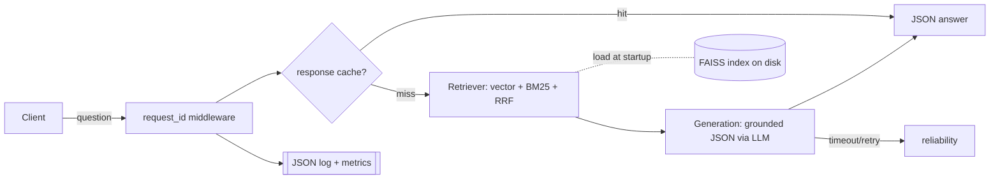

# Architecture

## Component map

| Component | File | Responsibility |
|---|---|---|
| Ingestion | `app/ingestion.py` | load → clean → chunk (recursive + section), metadata, JSONL persist |
| Embedding cache | `app/embedding_cache.py` | on-disk `sha256(text+model+prep)` → `.npy` |
| Embedder | `app/embeddings.py` | ST (prod) / hash (CI) behind one interface + cache wrapper |
| Vector store | `app/vectorstore.py` | FAISS `IndexFlatIP` (cosine), persist/load, meta+index_version |
| Hybrid | `app/hybrid.py` | BM25 lexical + Reciprocal Rank Fusion |
| Retriever | `app/retrieval.py` | embed → vector+BM25 → RRF → filter, retrieval LRU cache |
| Prompt | `app/prompts.py` | system prompt, context formatting, `PROMPT_VERSION` |
| Generation | `app/generation.py` | LLM call (OpenAI-compatible / stub), JSON parse, grounded contract |
| Reliability | `app/reliability.py` | timeout + retry with exponential backoff |
| Response cache | `app/response_cache.py` | TTL+LRU, invalidated by `index_version` |
| Observability | `app/observability.py` | JSON logs, `request_id`, rolling metrics |
| API | `app/main.py` | `/health` `/ready` `/ask` `/metrics`, middleware, degradation |

## Request flow (`POST /ask`)

## Scaling notes (defense §architecture)

- **1M docs:** `IndexFlatIP` is exact O(N) per query — swap to `IndexHNSWFlat` or IVF-PQ. Memory becomes the first wall (`N × dim × 4 bytes`); 1M × 384 × 4 ≈ 1.5 GB raw vectors before index overhead.
- **Embedding cost** dominates the build; the disk cache makes re-index incremental. Move embedding to a batch/async worker; the API should never embed the corpus.
- **Serving:** generation is the p95 driver — make the LLM call async, add a queue, and horizontally scale stateless API pods behind the shared index.
